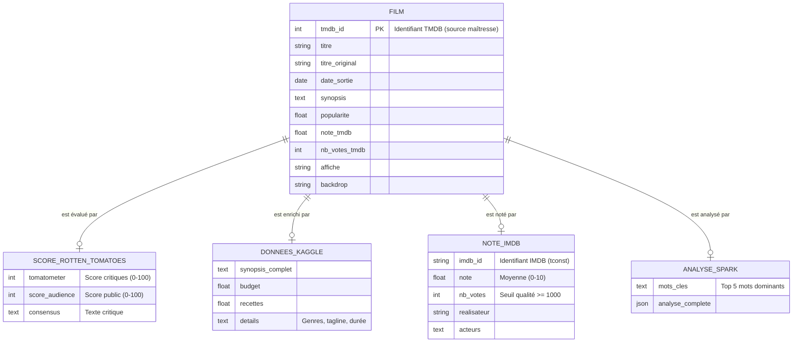

# MCD — Modèle Conceptuel de Données

> Méthodologie Merise | HorRAGor BOT Partie 1

---

## Diagramme

---

## Entités

### FILM *(entité centrale — source maîtresse TMDB)*

Toutes les autres entités gravitent autour de FILM et l'enrichissent via son identifiant `tmdb_id`.

| Attribut | Description |
|---|---|
| **tmdb_id** *(identifiant)* | Clé primaire — identifiant TMDB |
| titre | Titre officiel |
| titre_original | Titre dans la langue d'origine |
| date_sortie | Date normalisée ISO 8601 |
| synopsis | Description courte (TMDB) |
| popularite | Score de popularité TMDB |
| note_tmdb | Note moyenne TMDB (0-10) |
| nb_votes_tmdb | Nombre de votes TMDB |
| affiche | Chemin vers le poster |
| backdrop | Chemin vers l'image de fond |

---

### SCORE_ROTTEN_TOMATOES *(enrichissement 1 — Selenium)*

| Attribut | Description |
|---|---|
| tomatometer | Score des critiques (0-100%) |
| score_audience | Score du public (0-100%) |
| consensus | Texte du consensus des critiques |

---

### DONNEES_KAGGLE *(enrichissement 2 — Polars CSV)*

| Attribut | Description |
|---|---|
| synopsis_complet | Synopsis détaillé (plus riche que TMDB) |
| budget | Budget du film (en dollars) |
| recettes | Recettes au box-office |
| details | Genres, tagline, durée regroupés |

---

### NOTE_IMDB *(enrichissement 3 — SQLite)*

Seuls les films avec `nb_votes >= 1000` sont conservés (seuil qualité imposé par le PDF).

| Attribut | Description |
|---|---|
| **imdb_id** *(identifiant)* | Identifiant IMDB (`tconst`) — clé de réconciliation MDM niveau 2 |
| note | Note moyenne IMDB (0-10) |
| nb_votes | Nombre de votes (>= 1000) |
| realisateur | Nom(s) du réalisateur |
| acteurs | Noms des acteurs principaux |

---

### ANALYSE_SPARK *(enrichissement 4 — PySpark)*

| Attribut | Description |
|---|---|
| mots_cles | Top 5 mots dominants extraits du synopsis |
| analyse_complete | Résultat JSON complet de l'analyse |

---

## Associations et cardinalités

| Association | Cardinalité | Signification |
|---|---|---|
| FILM — SCORE_RT | `(1,1) — (0,1)` | Un film peut avoir 0 ou 1 score RT |
| FILM — DONNEES_KAGGLE | `(1,1) — (0,1)` | Un film peut avoir 0 ou 1 entrée Kaggle |
| FILM — NOTE_IMDB | `(1,1) — (0,1)` | Un film peut avoir 0 ou 1 note IMDB |
| FILM — ANALYSE_SPARK | `(1,1) — (0,1)` | Un film peut avoir 0 ou 1 analyse Spark |

Les cardinalités `(0,1)` reflètent le fait que l'enrichissement est **progressif** : un film ingéré depuis TMDB peut ne pas encore avoir été enrichi par les autres sources.

---

## Justification du modèle

Le MCD retient **une entité par source de données**. Ce choix est motivé par :

- **Traçabilité** : chaque donnée est rattachée à sa source d'origine, conformément à la stratégie MDM du PDF
- **Indépendance des sources** : une source indisponible (RT inaccessible, IMDB absent) n'affecte pas les autres
- **Cohérence avec le pipeline** : chaque étape du pipeline (`--tmdb`, `--rt`, `--kaggle`…) alimente exactement une entité
- **Conformité Merise** : le modèle conceptuel reflète la réalité métier avant tout choix technique
